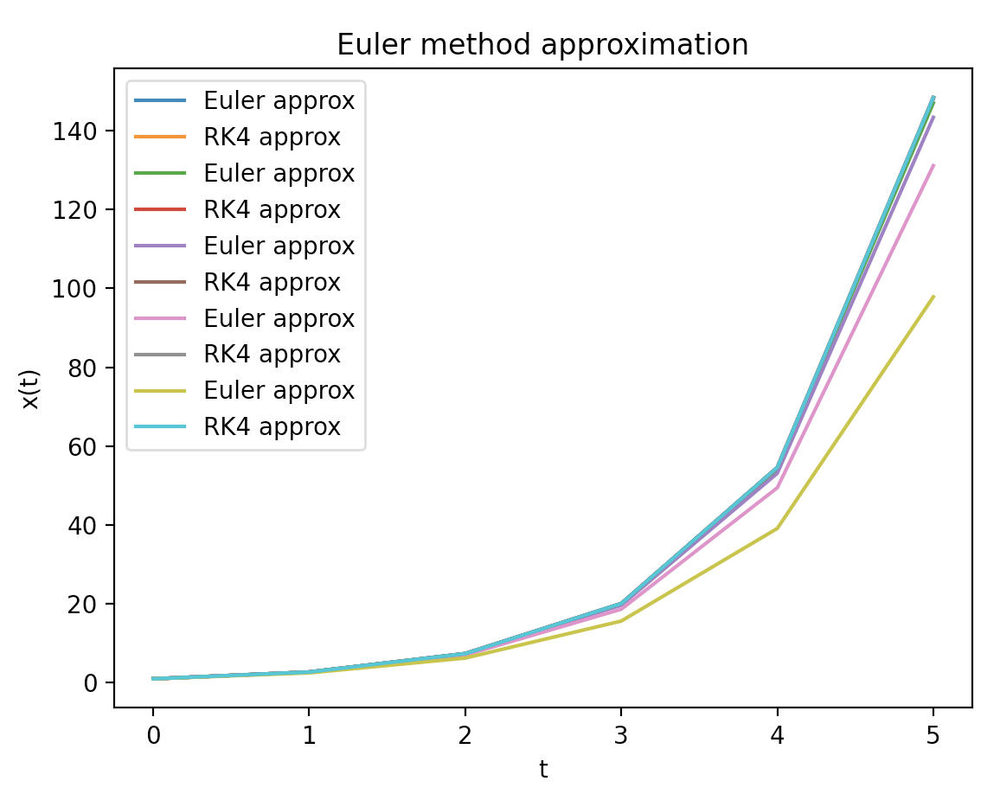
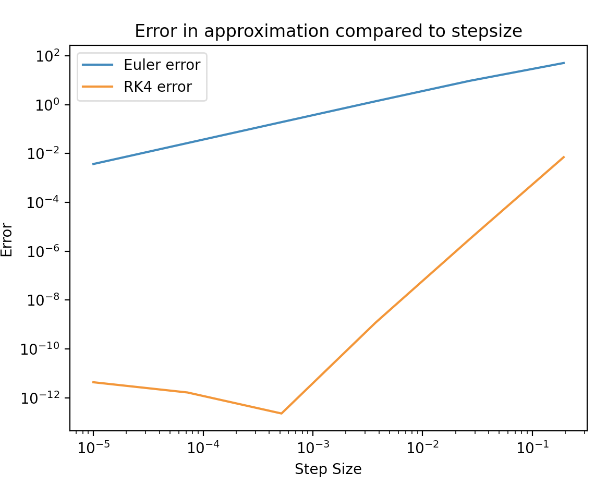
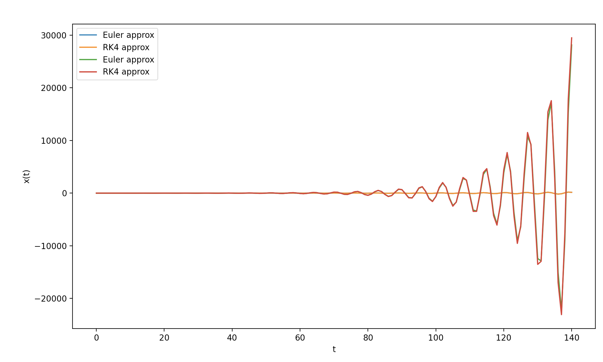

# Scientific-Computing

**Initial value problems for ODE's**
Found the solution at t = 5 for \dot{x} = x where x(0) = 1 to be approximately 148 using the Euler and the 4th order Runge-Kutta(RK4) methods. Using the analytical solution x(t) = e^t I found this to be true. The larger the step size the smaller the approximation due to this function diverging at t tends to infinity. The graph below illustrates this

Format: 

A double log error graph is also plotted below showing that for Euler as step size increases as does error due to truncation error. Whereas, for RK4 there is an initial rounding error for small step sizes which then decreases up to an optimal point. The error then begins to increase with step size due to truncation error similarly to the Euler method.

Format: 

I then altered my code so that it could handle second order ODE's by changing the use of the ODE parameter in my functions so that they could handle a list of two ODE's. The way this is done is by manually splitting my second order ODE into two first order ODEs. These can then be used simultaneously within my solve_to function that calculates the Euler or RK4 approximation at each step. The plot below shows the Euler and RK4 approximation of \ddot{x} = - x. Which is equivalent to \dot{x} = y and \dot{y} = -x.

Format: 
