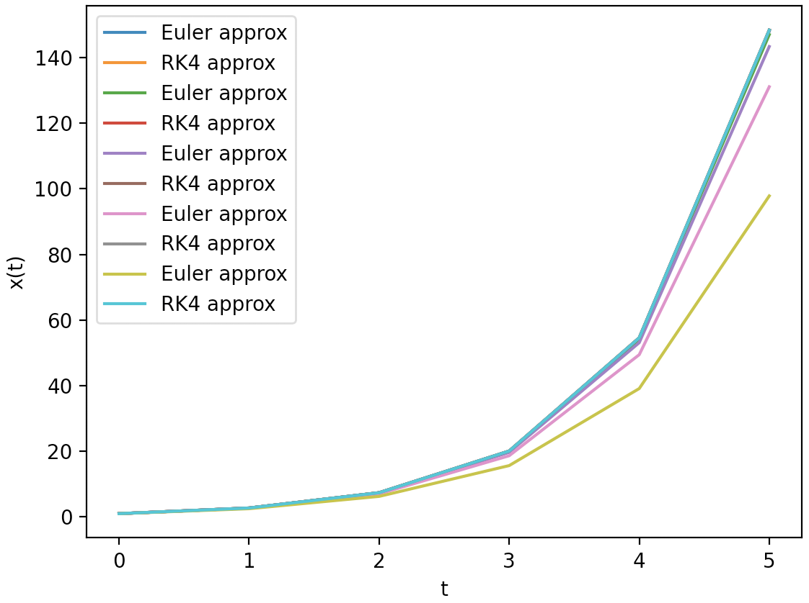
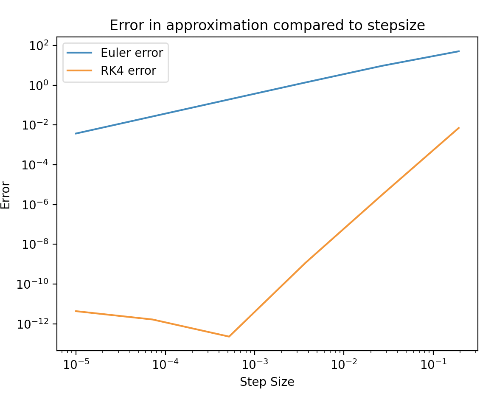
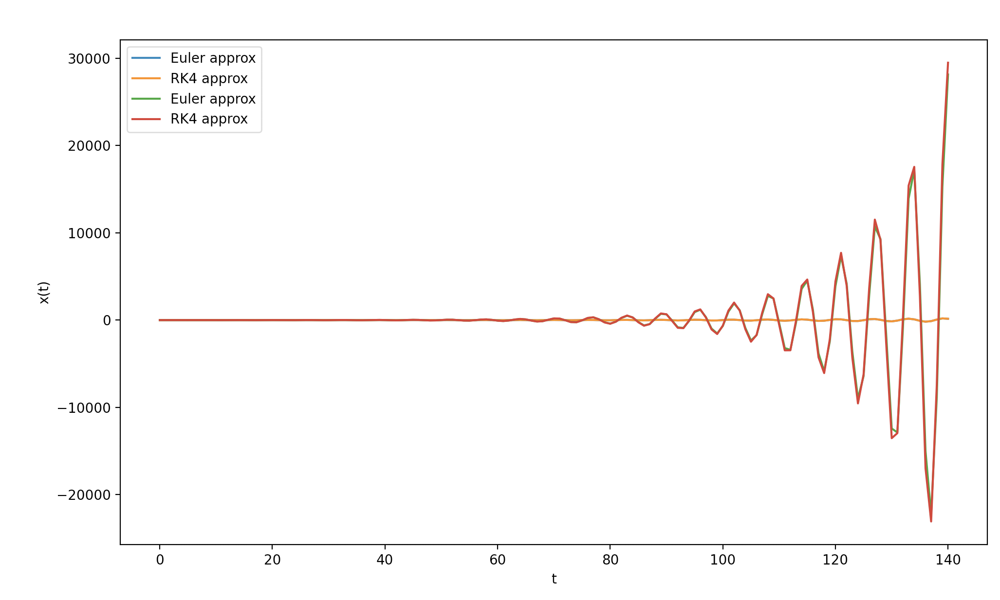
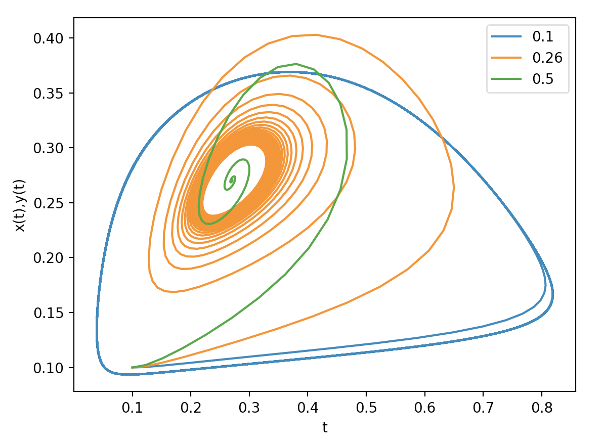

# Scientific-Computing

**Initial value problems for ODE's**
Found the solution at t = 5 for \dot{x} = x where x(0) = 1 to be approximately 148 using the Euler and the 4th order Runge-Kutta(RK4) methods. Using the analytical solution x(t) = e^t I found this to be true. The larger the step size the smaller the approximation due to this function diverging at t tends to infinity. The graph below illustrates this

Format: 

A double log error graph is also plotted below showing that for Euler as step size increases as does error due to truncation error. Whereas, for RK4 there is an initial rounding error for small step sizes which then decreases up to an optimal point. The error then begins to increase with step size due to truncation error similarly to the Euler method.

Format: 

I then altered my code so that it could handle second order ODE's by changing the use of the ODE parameter in my functions so that they could handle a list of two ODE's. The way this is done is by manually splitting my second order ODE into two first order ODEs. These can then be used simultaneously within my solve_to function that calculates the Euler or RK4 approximation at each step. The plot below shows the Euler and RK4 approximation of \ddot{x} = - x. Which is equivalent to \dot{x} = y and \dot{y} = -x.

**ODE problems without initial conditions**
The Lokta-Volterra equation is a predator prey equation where the red line in the graph below shows the predator and the orange the prey. The equation shows oscillations in the size of the population overtime.

Format: 

When b < 0.26 the population will decline very slowly overtime due to either the mortality rate being low or birth rate being high.

Whereas, when b > 0.26 the population will decrease at a much quicker rate as mortality rate may be very high or birth rate may be very low.

NB: I tested various b values and found anywhere less than or equal to 0.26 resulted in birufication meaning a stable solution.

Also, when we plot a birification diagram/phase portrait we witness a spiral when b > 0.26 and a blob when b < 0.26. No matter what initial conditions we use we will also end up with either of these two circumstances. This is shown below:

Format: 

We can also plot the last values for predator and prey against different values of b as shown below. This plot shows us that b < 0.26 is unstable and beyond that the population becomes stable.

**The initial software**

The initial task in the development of this software was to implement a simple Euler method step for a first order ODE. This was easily done with input of the initial dependant(x0) and independent variables(t0), an arbitrary step size and the ODE you want to solve for. This function then outputs its guess for the solution to the ODE at t1(t0 + step_size) to be x1.

The next step required to take was producing an array of solutions between two values. I made a solve_to function to split the two values into equally spaced steps this is to create an accurate array of approximations between the two values. The solve_to driver function found all the steps between each approximation and returned only the final step. As a result if the user provided a smaller step size the approximation was likely to be more accurate as a result of the work going on inside this function. The use of this enables the user to choose whether they was quick and less accurate approximation or slow and highly accurate ones.

The next function needed was a function called solve_ode that uses solve_to and euler_step and stores the approximations between the initial t and the target value of t. This was a useful way to plot the function and is what the user is likely to use most. To begin with I had many different variables being initialised at the start of the code and then adding these to arrays afterwards causing the code for this function to be quite long and less eloquent. I decided to instead initialise arrays with these variables already in them and use indexing of the arrays to make the code a lot sorter and easier to understand.

**Decisions I made along the way**
The first module I started working on is the file named solver_functions the main function in this file is solve_ode as it requires the use of all other functions to work. When creating unit tests I ordered them in a way that would check the most inner functions first e.g. euler_step. Since, for solve_to to work it requires euler_step to work and the same goes for solve_ode and solve_to. Hence, when testing it would give a clearer understanding of where the functions are going wrong.

When I began making tests for my code I realised the user may not want to have to put inputs for everything all the time. As a result I set up a lot of defaults for functions if the user didn't specify. For example, making runge-kutta the default method if the user didn't input --euler as it is more accurate. Other things include; step_size being set to 0.01 and number of steps between t0 and target being n=500.

*talk about period finder making even poor inital guesses work well*

*From early on I realised I needed to use numpy arrays*

*talk about setting runge-kutta to default*
*also having defaults for other variables*

*Talk about modularising code early on*

*Talk about separate files for shooting and continuation*

**Learning log**

When making the solve_to function I needed to split the independent variable values up evenly. However, it was often the case that the difference between the t values needed to approximate for didn't divide into a whole number for the amount of steps needed. To overcome this I divided as I needed then converted the number of steps into an integer and then added an  extra step to fill the rest of the space needed for the approximation.

I also noticed that if the user inputed that it wanted to approximate for t=0 the function would produce an error due to division by 0. Hence, I added an if statement to handle this.

